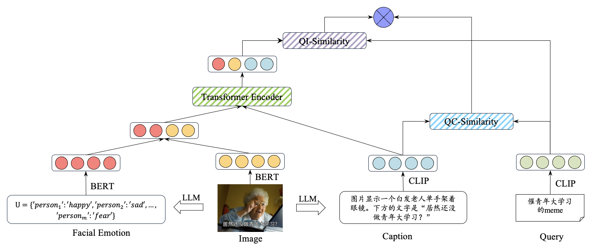

<div align="center">
<h2>A Benchmark for Cross-Modal Emotion-Infused Internet Meme Recommendation</h2>
</div>


Welcome to **A Benchmark for Cross-Modal Emotion-Infused Internet Meme Recommendation**. Firstly, we developed the Meme Recommendation benchmark, consisting of 6 communities, 3630 topics, and 148,886 records, along with evaluation metrics and statistical analysis to ensure quality. Building upon this, we propose the IEF model, which integrates the emotional features of memes to capture users’ emotional needs effectively. 

</p></details>

<-- The dataset will be updated subsequently. -->


## Overview
The IEF model primarily consists of two parts: QI-similarity and QC-similarity. QI-similarity represents the interactions between the query and the emotion-embedded image. QC-similarity represents the interactions between the query and the image caption. Finally, the two are weighted to obtain the final similarity results.




<!-- ## Content
- [Prerequisites](#prerequisites)
- [Data Preparation](#data-preparation)
- [Training](#training)
- [BibTeX & Citation](#bibtex)
- [Acknowledgment](#acknowledgment) -->


## Requirement
```sh
# From CLIP
conda install --yes -c pytorch pytorch=1.9.1 torchvision cudatoolkit=11.1
pip install ftfy regex tqdm
pip install opencv-python boto3 requests pandas
```

## Dataset
All meme datasets can be downloaded from respective official links. The dataset will be updated subsequently.

| Name | Official Link|
|:------------:|:-------------------:|
| Douban MEMERS | [Dataset](http://xxxxxx)| | 
| English Memes | [Dataset](https://xxxxxx)| |
| Nobody Gets My Memes | [Dataset](https://xxxxxx)| |
| Humans Love Memes | [Dataset](https://xxxxxx)| |
| Recent Popular Memes | [Dataset](https://xxxxxx)| |
| Let's exchange Memes | [Dataset](https://xxxxxx)| |

## How to Run
- First, you need to prepare a dataset that has generated captions and extracted emotional features.
- Next, download the [CLIP B/32](https://openaipublic.azureedge.net/clip/models/40d365715913c9da98579312b702a82c18be219cc2a73407c4526f58eba950af/ViT-B-32.pt) models and place them in the `modules` folder. 
- Finally, execute the following command to train Douban MEMERS dataset.

  ```sh
  # For more details, please refer to the co_train_douban_memers.sh  
  # DATA_PATH=[Your data path]
  sh co_train_douban_memers.sh
  ```

## 🎗️ Acknowledgement
This repository is built in part on the excellent works of [CLIP4Clip](https://github.com/ArrowLuo/CLIP4Clip) and [DRL](https://github.com/foolwood/DRL). We use Gemini(gemini-pro-vision) to pre-extract captions and emotion features from the videos.
We extend our sincere gratitude to these contributors for their invaluable contributions.

